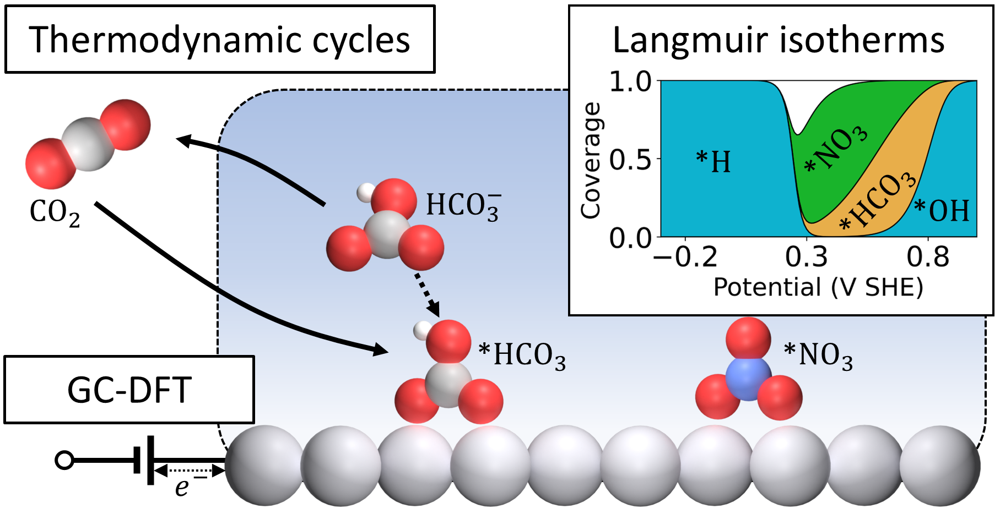

# Public repository for: *Predicting Competitive Anion Electrosorption on Late Transition Metals*

This repository contains input and output files for grand-canonical density function theory (**GC-DFT**)
calculations, and multiple linear regression (**MLR**) descriptors as presented in our paper:

*Predicting Competitive Anion Electrosorption on Late Transition Metals*

*Bolton Tran and Bryan R. Goldsmith*

*Chemical Science* [https://doi.org/10.1039/D5SC03757C](https://doi.org/10.1039/D5SC03757C)

## Repository structure

The repository is organized into `GCDFT-data` and `MLR-data`.

`GCDFT-data` contains:
- `optimization`: optimized geometries and DFT calculation input for all surfaces and molecules.
- `vibration`: modified [*ASE-JDFTx*](https://jdftx.org/ASE.html) interface for perform vibration calculations.

`MLR-data` contains:
- `NWChem-descriptors`: input and output of DFT calculations performed in [*NWChem*](https://nwchemgit.github.io/index.html) for extracting anion features.
- `VASP-descriptors`: input and output of DFT calculations performed in [*VASP*](https://www.vasp.at/) for extracting dipole feature.

`python-analysis` contains:
- `GCDFT_compile`: Excel file with comprehensive compilation of GC-DFT output for all adsorbate systems in this study.
- `GCDFT_MLR`: Jupyter Notebook that reads the Excel file and run multiple linear regression analyses using [*pandas*](https://pandas.pydata.org/) and [*scikit-learn*](https://scikit-learn.org/stable/).
- `GCDFT_Langmuir`: Jupyter Notebook that runs non-linear solvers based on [*scipy.optimize.fsolve*](https://docs.scipy.org/doc/scipy/reference/generated/scipy.optimize.fsolve.html) to obtain potential-dependent Langmuir isotherms.

## License  
- **Code/Software**: Licensed under [MIT](./LICENSE-CODE).
- **Data/Results**: Licensed under [CC BY 4.0](./LICENSE-DATA), requiring attribution to the original paper.